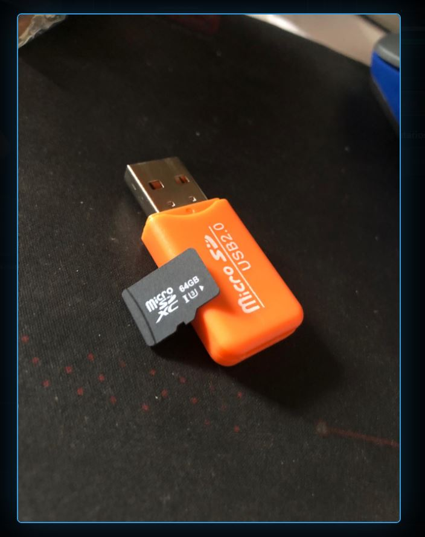

# 🚨 Exfiltración Demo — Scripts Educativos USB

> Scripts de demostración que simulan una exfiltración rápida de archivos desde un USB. Disponible para Windows (.bat) y Linux (.sh). Desarrollado con fines educativos para concientización en seguridad informática.

[](https://es.wikipedia.org/wiki/Hacking_%C3%A9tico)
[](https://microsoft.com)
[](https://linux.org)

---

## ⚠️ Aviso Legal

Estos scripts están desarrollados **únicamente con fines educativos y de concientización**. Su uso debe realizarse **exclusivamente en entornos controlados y con autorización explícita** del propietario del equipo. El autor no se responsabiliza por el uso indebido de este material.

---

## 📂 Scripts incluidos

### 🪟 Windows — `clonador_demo.bat`
Copia archivos del Escritorio (`.docx`, `.pdf`, `.txt`, `.jpg`, `.png`) a una carpeta `EXFILTRADO` dentro del USB desde donde se ejecuta.

**Cómo funciona:**
1. Detecta automáticamente la letra del USB
2. Crea la carpeta `EXFILTRADO` en el USB
3. Copia los archivos del Escritorio
4. Muestra un aviso `DEMO COMPLETADA`

---

### 🐧 Linux — `clonador_demo.sh`
Mismo comportamiento pero para Linux/Mac. Detecta automáticamente si el Escritorio se llama `Escritorio` o `Desktop`.

**Para ejecutar:**
```bash
chmod +x clonador_demo.sh
./clonador_demo.sh
```

---

## 🛡️ ¿Para qué sirve esta demo?

Muestra lo que puede pasar si dejás tu PC desbloqueada con un USB conectado. En segundos, cualquier archivo del Escritorio puede ser copiado sin que lo notes.

**¿Cómo protegerte?**
- Bloqueá tu PC siempre que te alejés (`Win + L`)
- No conectés USBs desconocidos
- Usá políticas de bloqueo de dispositivos USB en entornos corporativos
- Guardá archivos sensibles fuera del Escritorio

---

## 📸 Hardware



---

## 👤 Autor

**Luis García** — [@LuisGarcia-InfoSec](https://www.linkedin.com/in/luis-garc%C3%ADa-8138762b6/)  
Analista de Ciberseguridad & Forense Digital · Buenos Aires, Argentina  
🌐 [proyects-luis.netlify.app](https://proyects-luis.netlify.app)

---

*Desarrollado para concientización en seguridad. Probado en entornos controlados.*
